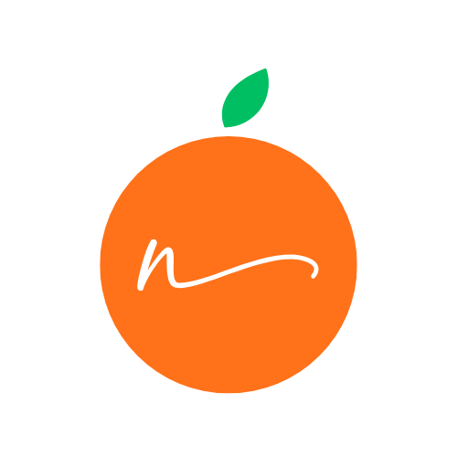

# 🍽️ NutriNotion

<div align="center">
  
  
  **Your Personal Nutrition Companion**
  
  
  
  
  
</div>

---

## 📱 About NutriNotion

NutriNotion is a personalized nutrition tracking app that delivers AI-generated meal plans based on your dietary preferences, health goals, and mess menu availability. The Flutter frontend communicates with a Spring Boot REST backend to fetch, generate, and track personalized daily meals and calorie summaries.

### ✨ Key Features

🎯 **Personalized Meal Planning**

- Backend-generated daily meal plans (Breakfast, Lunch, Snacks, Dinner)
- Customized based on dietary preferences, allergies, and fitness goals
- Real-time mess menu integration

✅ **Meal Check-off Tracking**

- Tap any meal item to mark it as consumed
- Optimistic UI updates with automatic revert on failure
- Live calorie summary (consumed vs. target vs. remaining)

📊 **Smart Analytics**

- GitHub-style streak tracking for daily calorie goals
- Daily, weekly, and monthly progress visualization
- Comprehensive nutrition insights

👤 **User Profile & Onboarding**

- Multi-step onboarding: height/weight, lifestyle, diet preferences
- BMI calculation and health goal tracking
- Edit profile with real-time nutrition goal recalculation

💡 **Health Tips**

- Daily personalized nutrition tip surfaced from the meal plan API

🔐 **Authentication**

- Secure JWT-based login and registration via Spring Boot
- Persistent session management

---

## 🛠️ Tech Stack

| Layer            | Technology                                  |
| ---------------- | ------------------------------------------- |
| Frontend         | Flutter 3.6.2 (Dart 3.6.2)                  |
| Backend          | Spring Boot 3.x REST API                    |
| State Management | Provider (`ChangeNotifier`)                 |
| HTTP Client      | `package:http` via `ApiClient`              |
| Animations       | Rive                                        |
| Fonts            | Google Fonts (Lato, Poppins)                |
| UI               | Material 3, custom orange theme (`#FF721A`) |

---

## 🚀 Getting Started

### Prerequisites

- Flutter SDK 3.6.2 or higher
- Dart SDK 3.6.2 or higher
- Android Studio / VS Code
- Running instance of the [NutriNotion Spring Boot backend](https://github.com/NutriNotion/NutriNotion-Backend)

### Installation

1. **Clone the repository**

   ```bash
   git clone https://github.com/NutriNotion/NutriNotion-App.git
   cd NutriNotion-App
   ```

2. **Install dependencies**

   ```bash
   flutter pub get
   ```

3. **Configure the backend URL**

   Open `lib/services/api_client.dart` and set your backend base URL:

   ```dart
   // For Android emulator connecting to localhost Spring Boot:
   static const String _baseUrl = 'http://10.0.2.2:8080/api';
   // For physical device or production:
   static const String _baseUrl = 'http://<your-server-ip>:8080/api';
   ```

4. **Run the app**
   ```bash
   flutter run
   ```

---

## 🏗️ Project Structure

```
lib/
├── core/
│   ├── custom_colors.dart      # App color constants
│   └── page_transitions.dart   # Fade route transitions
├── models/
│   ├── user_model.dart         # User profile model
│   ├── personalized_meal_item.dart  # Single meal item model
│   └── calorie_summary.dart    # Daily calorie summary model
├── services/
│   ├── api_client.dart         # Base HTTP client (GET/POST/PUT/DELETE)
│   ├── auth_services.dart      # Login / signup API calls
│   ├── user_service.dart       # User profile & onboarding API calls
│   ├── user_api_service.dart   # Extended user / menu CRUD API calls
│   ├── mess_service.dart       # Mess menu API calls
│   ├── calorie_tracking_service.dart  # Calorie data API calls
│   └── personalized_meal_service.dart # Personalized meal plan API calls
├── providers/
│   ├── auth_provider.dart      # Auth state (login/logout/session)
│   ├── user_provider.dart      # User profile state
│   ├── mess_provider.dart      # Mess menu state
│   ├── nutrition_provider.dart # BMR/TDEE calculation & nutrition goals
│   └── personalized_food_provider.dart  # Meal plan + calorie summary state
├── views/
│   ├── auth/                   # Login & signup screens
│   ├── landing/                # App landing / welcome screen
│   ├── onboarding/             # Multi-step onboarding flow
│   ├── home/                   # Main dashboard (home_page.dart)
│   ├── analytics/              # Analytics & streak dashboard
│   └── profile/                # Profile view & edit screens
├── widgets/                    # Reusable UI components
└── main.dart                   # App entry point & route table
```

---

## 🔌 API Endpoints Used

| Method | Endpoint                                          | Purpose                       |
| ------ | ------------------------------------------------- | ----------------------------- |
| `GET`  | `/api/personalized-meals/{userId}/today`          | Fetch today's meal plan       |
| `POST` | `/api/personalized-meals/{userId}/generate-today` | Generate today's meal plan    |
| `PUT`  | `/api/personalized-meals/item/{itemId}/check`     | Mark/unmark a meal item       |
| `GET`  | `/api/calories/{userId}/today`                    | Fetch today's calorie summary |
| `GET`  | `/api/users/{userId}`                             | Fetch user profile            |
| `PUT`  | `/api/users/{userId}`                             | Update user profile           |
| `PUT`  | `/api/onboarding/{userId}`                        | Save onboarding data          |
| `GET`  | `/api/mess-menu/{day}`                            | Fetch mess menu for a day     |

---

## 📊 Features Overview

### 🏠 Dashboard

- **Personalized meal sections**: Breakfast, Lunch, Snacks, Dinner with item check-off
- **Live calorie ring**: Consumed / Target / Remaining with color-coded status
- **Full menu drawer**: Browse all available mess items and add them locally
- **Daily health tip**: Surfaced from meal plan API response
- **Quick navigation**: Analytics, full menu, profile

### 📈 Analytics

- **GitHub-style calendar heatmap**: Color-coded daily goal achievement
- **Stats bar**: Total days tracked, current streak, best streak
- **Monthly breakdown**: Day-by-day calorie progress

### 👤 Profile & Onboarding

- Height, weight, age, gender, activity level, fitness goal, diet type
- Allergy and disliked food preferences
- BMI display and automatic TDEE-based calorie target recalculation on edit

---

## 🎨 Design System

### Color Palette

- **Primary**: Orange `#FF721A` — energy and nutrition
- **Background**: Cream `#FFFBF7` — warm and welcoming
- **Success**: Green — goals met / items checked
- **Warning**: Red — calorie deficit alerts

### Typography

- **Primary**: Google Fonts — Lato
- **Secondary**: Google Fonts — Poppins

---

## 🧪 Testing

```bash
flutter test
```

---

## 📦 Build & Deployment

### Android

```bash
flutter build apk --release
flutter build appbundle --release
```

### iOS

```bash
flutter build ios --release
```

---

## 🤝 Contributing

1. Fork the repository
2. Create a feature branch: `git checkout -b feature/your-feature`
3. Commit changes: `git commit -m 'Add your feature'`
4. Push to branch: `git push origin feature/your-feature`
5. Open a Pull Request

---

## 📄 License

This project is licensed under the MIT License — see the [LICENSE](LICENSE) file for details.

---

## 🙏 Acknowledgments

- Flutter team for the framework
- Spring Boot for the backend runtime
- Rive for beautiful loading animations
- Google Fonts for typography
- The open-source community for inspiration

---

## 📞 Support

For support, email support@nutrinotion.com or join our [Discord community](https://discord.gg/nutrinotion).

---

<div align="center">
  
  **Made with ❤️ by the NutriNotion Team**
  
  [Website](https://nutrinotion.com) • [Privacy Policy](https://nutrinotion.com/privacy) • [Terms of Service](https://nutrinotion.com/terms)
  
</div>
